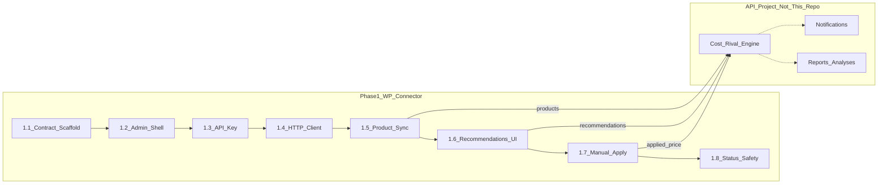

<!--
artifact_contract: ce-unified-plan/v1
artifact_readiness: implementation-ready
product_contract_source: ce-plan-bootstrap
execution: code
-->

---
title: WP plugin fundamentals (Phase 1.1)
date: 2026-09-07
artifact_contract: ce-unified-plan/v1
artifact_readiness: implementation-ready
product_contract_source: ce-plan-bootstrap
execution: code
origin: STRATEGY.md; docs/plans/2026-09-03-001-feature-dynamic-repricer-iran-plan.md
---

# WP plugin fundamentals (Phase 1.1)

## Goal Capsule

**Objective:** Establish the WordPress connector foundation only — a written WP↔API contract and a installable WooCommerce plugin skeleton — so later Phase 1 plans can add API key connect, product sync, and manual price apply without rewriting structure.

**Product Authority:** Mohammad Ali (project owner)

**Authority hierarchy:** `STRATEGY.md` (product approach) → this plan (first WP slice) → later Phase 1.x plans. Broader product requirements live in `docs/plans/2026-09-03-001-feature-dynamic-repricer-iran-plan.md` and are not implemented here.

**Stop conditions:** Do not build API-key UI, HTTP calls, product sync, price updates, notifications, reports, or auto-apply in this plan. Those belong to later Phase 1.x plans listed below.

**Product Contract preservation:** Bootstrap from session + strategy; not an in-place enrichment of the 2026-09-03 requirements-only plan (that remains the product-wide source).

---

## Product Contract

### Problem

Pricing is a SaaS; WordPress is only a connector. The API project does not exist yet. Starting the plugin without a thin contract and a standard scaffold will couple WP code to invent-as-you-go endpoints and make first-time WP work chaotic.

### Primary Actor

- A1. Plugin implementer (you) working in this repo
- A2. Iranian WooCommerce seller (future end user; not served by UI in this plan)

### Desired Outcome

After this plan: a documented WP↔API boundary, a plugin that installs and activates on a WooCommerce site, and a clear queue of small follow-on plans for the rest of Phase 1 (connect + sync + manual apply).

### Requirements

- R1. Document a thin WP↔API contract covering only Phase 1 connector needs: API-key auth, product sync (store → API), recommended price read, and acknowledge applied price.
- R2. Scaffold a WordPress plugin in this repo that declares WooCommerce as a dependency and fails activation cleanly when WooCommerce is missing.
- R3. Plugin uses a stable text domain / prefix (`pricing` / `pricing_`) so later units do not rename everything.
- R4. Admin entry point exists as a menu stub only (empty or “coming soon” screen) — no settings forms yet.
- R5. Brand tokens from the landing brand system (`#237227`, `#519A66`, `#FFAA00`, `#FFD786`, Estedad/Vazirmatn direction) are recorded for WP admin CSS variables for later UI plans; this plan may add a minimal CSS variables file but not a designed settings UI.
- R6. Phase 1 overall outcome (API key connect + sync products + manual apply recommended price) is split into many small plans; this plan is only 1.1.

### Key Flows

- F1. Implementer installs the plugin on a local WooCommerce site → sees Pricing menu stub → no fatals.
- F2. Implementer reads `docs/contracts/wp-api-v1.md` (or OpenAPI sibling) and knows which endpoints the future API must provide before WP features beyond the stub can ship.

### Acceptance Examples

- AE1. Given WooCommerce active, when the plugin is activated, then WP admin shows a top-level or WooCommerce submenu “Pricing” without PHP errors.
- AE2. Given WooCommerce inactive, when activation is attempted, then activation fails with a clear admin notice and the plugin does not stay active.
- AE3. Given the contract doc, when an API engineer starts the API project, then they can implement Phase 1 endpoints without reading WP PHP.

### Scope

**In scope (1.1 only)**

- WP↔API contract doc for Phase 1 connector surface
- Plugin folder layout + main bootstrap file
- WooCommerce dependency guard
- Empty admin menu page
- Brand token notes / minimal CSS variables stub
- Phase 1 micro-plan roadmap (documentation only)

**Out of scope (later plans)**

- API key input, storage, validation
- HTTP client / real API calls
- Product catalog sync
- Recommended price display or apply
- Auto-apply, cron, webhooks
- Notifications, reports, analyses (API-owned forever)
- Zhaket/RTL packaging, Instagram, public seller API

### Success Criteria

- Plugin zip/folder activates on local WooCommerce without errors
- Contract lists request/response fields for the four Phase 1 operations
- Next plan (1.2) has a clear starting file list

---

## Planning Contract

### Settled decisions (session)

- KTD1. API-first ownership: notifications, reports, analyses, cost engine, rival prices live in the API project; WP only does store-local work (auth connector UX, product price writes, WP admin surfaces that must touch WooCommerce). `Governs R1, R6`
- KTD2. API does not exist yet → write the contract first, then scaffold the plugin against that contract (stubs later). `Governs R1, R2`
- KTD3. Phase 1 product slice is connect + sync + manual apply, but delivered as many small plans; this artifact is fundamentals only. `Governs R6`
- KTD4. Brand system source of truth remains the landing brand doc; WP copies token values into plugin CSS vars, does not invent a new palette. `Governs R5`

### Technical design

**Repo layout**

```
plugin/pricing/                 # WordPress plugin root (shippable folder)
  pricing.php                   # Plugin bootstrap / headers
  includes/
    class-plugin.php
    class-dependencies.php
    class-admin-menu.php
  assets/
    css/admin-tokens.css        # Brand CSS variables only
  languages/                    # empty placeholder for fa_IR later
docs/
  contracts/
    wp-api-v1.md                # Human-readable Phase 1 contract
    wp-api-v1.openapi.yaml      # Machine-readable sibling (same surface)
```

**Contract surface (Phase 1 only — directional, not full API product)**

| Operation | Direction | Purpose |
|-----------|-----------|---------|
| `POST /v1/connector/validate` | WP → API | Validate API key; return shop/plan stub |
| `POST /v1/connector/products/sync` | WP → API | Upsert WooCommerce products (id, sku, name, price, currency) |
| `GET /v1/connector/products/{external_id}/recommendation` | WP → API | Fetch recommended price + floor flags |
| `POST /v1/connector/products/{external_id}/applied` | WP → API | Tell API which price WP applied (manual) |

Auth: `Authorization: Bearer <api_key>` (or `X-Pricing-Key`) — pick one in the contract doc and stick to it.

**WP principles (first-time safe)**

- One main plugin file with WordPress plugin headers
- Classes under `includes/`, loaded from bootstrap
- Prefix all options/hooks (`pricing_`)
- Check `class_exists( 'WooCommerce' )` before registering features
- No Composer required for 1.1 (add later if needed)

### Assumptions

- Local WordPress + WooCommerce will be used for smoke checks (LocalWP, Docker, or existing local site) — exact toolchain chosen at implementation time.
- API base URL will become a setting in plan 1.3; contract uses a placeholder host.
- Farsi/RTL admin polish starts in plan 1.2, not 1.1.

### Phase 1 micro-plan roadmap (not implemented here)

| Plan | Title | Outcome |
|------|-------|---------|
| **1.1 (this)** | Fundamentals | Contract + installable scaffold + menu stub |
| 1.2 | Admin shell + brand | RTL-ready admin page chrome using brand tokens |
| 1.3 | API key connect | Save key, call validate, show connected/disconnected |
| 1.4 | HTTP client | Shared WP HTTP wrapper, errors, timeouts |
| 1.5 | Product sync | Push WooCommerce products to API |
| 1.6 | Recommendations UI | Show recommended price per product in WP admin |
| 1.7 | Manual apply | Write recommended price to WooCommerce product; notify API `applied` |
| 1.8 | Status & safety | Last sync, connection health, refuse apply below floor if API flags it |

Phase 1 stops at 1.8. Auto-apply, alerts inbox in WP, reports, analyses → later phases / API project.



---

## Implementation Units

### U1. Write Phase 1 WP↔API contract

**Goal:** Freeze the thin connector API surface so WP and the future API project share one source of truth.

**Requirements:** R1, R6  
**Files:** `docs/contracts/wp-api-v1.md`, `docs/contracts/wp-api-v1.openapi.yaml`

**Approach:** Document the four operations in the design table with method, path, headers, request/response JSON examples, and error shapes (`401` invalid key, `403` plan inactive, `422` validation). Mark non-Phase-1 endpoints as explicitly out of scope. Prefer Bearer API key unless OpenAPI review finds a strong reason otherwise.

**Test scenarios:**

- T1. Contract lists all four Phase 1 operations with example payloads.
- T2. Contract states auth header name and that notifications/reports are out of scope for WP.
- T3. OpenAPI sibling matches the markdown operations (same paths).

---

### U2. Scaffold installable plugin bootstrap

**Goal:** Create a WooCommerce-aware plugin that loads without fatals.

**Requirements:** R2, R3  
**Files:** `plugin/pricing/pricing.php`, `plugin/pricing/includes/class-plugin.php`, `plugin/pricing/includes/class-dependencies.php`

**Approach:** Standard WP plugin headers (Plugin Name: Pricing, Text Domain: `pricing`). On `plugins_loaded`, boot a small `Pricing\Plugin` class. Dependency class checks WooCommerce; on failure during activation, call `deactivate_plugins` and show an admin notice. Do not register product or price hooks yet.

**Test scenarios:**

- T1. With WooCommerce active, activate plugin → no PHP fatal; plugin remains active.
- T2. Without WooCommerce, activate plugin → deactivated + clear notice.
- T3. Plugin headers include Name, Version, Text Domain, Requires Plugins / WooCommerce check behavior documented in README snippet.

---

### U3. Admin menu stub + brand CSS variables

**Goal:** Prove the admin entry point and lock brand tokens for later UI plans.

**Requirements:** R4, R5  
**Files:** `plugin/pricing/includes/class-admin-menu.php`, `plugin/pricing/assets/css/admin-tokens.css`, `plugin/pricing/readme.txt` (or short `plugin/pricing/README.md` for local install)

**Approach:** Register a top-level admin menu “Pricing” (or WooCommerce submenu — prefer top-level for brand visibility). Render a minimal placeholder page (title + one sentence in Persian or bilingual stub). Enqueue `admin-tokens.css` only on plugin pages; define `--pricing-brand`, `--pricing-brand-muted`, `--pricing-gold`, `--pricing-gold-soft` from the landing brand system. No forms, no API key field.

**Test scenarios:**

- T1. Admin user opens Pricing menu → placeholder page renders.
- T2. CSS variables file contains the four brand hex/HSL values from the brand system.
- T3. Non-plugin admin pages do not load the Pricing CSS (screen-id guard).

---

## Verification Contract

- Manual smoke on a local WordPress + WooCommerce site: activate with/without WooCommerce; open Pricing menu.
- Contract review: markdown and OpenAPI paths match.
- No PHPUnit required for 1.1; introduce tests when HTTP client lands (plan 1.4).

## Definition of Done

- U1–U3 complete per their test scenarios
- Phase 1 roadmap table present in this plan (done)
- No API key UI, sync, or price writes shipped
- Ready to open plan 1.2 (admin shell) as a separate plan artifact

## Appendix

### Brand tokens (from landing brand system)

| Role | Hex | CSS variable (WP) |
|------|-----|-------------------|
| Brand | `#237227` | `--pricing-brand` |
| Brand muted | `#519A66` | `--pricing-brand-muted` |
| Accent gold | `#FFAA00` | `--pricing-gold` |
| Soft gold | `#FFD786` | `--pricing-gold-soft` |

Typography direction for later UI: Estedad Mad (headings) + Vazirmatn (body); RTL default for admin copy.

### Origin links

- `STRATEGY.md` — WP is connector; SaaS subscription; not a forever Zhaket plugin
- `docs/plans/2026-09-03-001-feature-dynamic-repricer-iran-plan.md` — full product contract (engine, rivals, channels)
