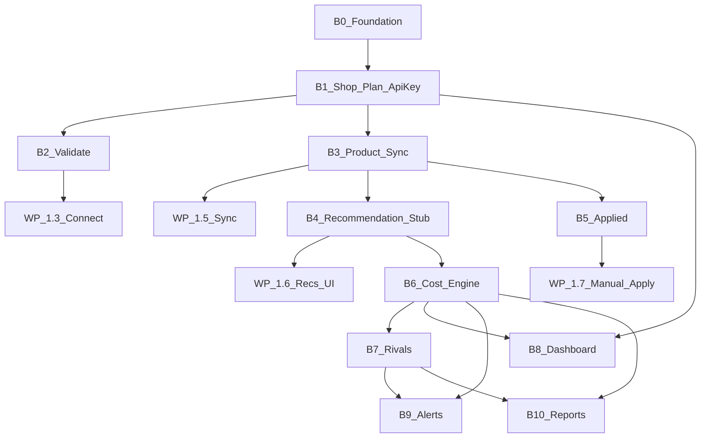

# Backend phases tracker

**Audience:** Product owner, product manager, backend implementer  
**Last reviewed:** 2026-09-22  
**Status source of truth:** this file (checkboxes). Contracts stay frozen in [`docs/contracts/wp-api-v1.md`](../contracts/wp-api-v1.md) and [`docs/contracts/wp-api-v1.openapi.yaml`](../contracts/wp-api-v1.openapi.yaml).

---

## How to use this document

1. Work top to bottom. A phase is **not started** until every prior **must-precede** phase is Done.
2. Mark `- [x]` only when the item is verified (test or smoke), not when code is sketched.
3. When a whole phase is Done, set its **Status** in the [phase map](#phase-map) to `Done` and bump **Last reviewed**.
4. Do not invent extra connector endpoints. If WP needs a new field, change the contract first, then this tracker.
5. WordPress plugin work is tracked in WP plans (`1.1`–`1.8`). This file tracks **only the Laravel API** in `api/`.

| Mark | Meaning |
|------|---------|
| `- [ ]` | Remaining |
| `- [x]` | Done and verified |
| Status: **Not started** | No meaningful work in `api/` yet |
| Status: **In progress** | Some checkboxes done, phase not shippable |
| Status: **Done** | Exit criteria met; WP or next backend phase can depend on it |
| Status: **Blocked** | Waiting on a decision, spike, or another track |

---

## Current snapshot (2026-09-22)

Connector MVP (**B0–B5**) plus **B6** cost engine are implemented in `api/`. WP can call a real `/v1/connector/*` API with a seeded Bearer key. Recommendations are **floor-aware** when a shop has a cost profile; otherwise a gated B4 stub applies in local/testing only.

| Area | Today | Gap |
|------|--------|-----|
| App skeleton | Laravel 13, PHP 8.3, Pest, Pint, Larastan, Inertia welcome page | — |
| Health | `GET /up` | Not a product endpoint |
| Auth | Bearer shop API keys on connector routes; `users` table unused until B8 | Dashboard login (B8) |
| Connector contract | Four frozen endpoints live under `/v1` | — |
| Cost / rival engine | Floor-aware `floor_plus_margin` (equal-split overhead) | Rivals (B7); cost UI (B8) |
| WP plugin | Phase **1.1–1.7** in plugin track | 1.8 floor refuse; packaging |

---

## Product intent (backend)

Pricing is a **SaaS**. WordPress is a store connector, not the product.

The backend owns:

- Shop identity, plans, and API keys
- Product catalog received from WooCommerce
- Cost floor and recommended price
- Rival prices (Torob / Snapp as intelligence, not sales channels)
- Notifications, reports, and the seller dashboard

WordPress only: authenticate, push products, read a recommendation, acknowledge a **manual** apply.

**First backend outcome (MVP connector):** a WooCommerce seller can paste an API key, sync products, see a recommended price, apply it by hand, and the API records that apply — without building Torob scraping or auto-apply.

---

## Authority

| Source | Role |
|--------|------|
| `STRATEGY.md` | Product approach: API-first, WP connector first, SaaS subscription |
| `docs/plans/2026-09-03-001-feature-dynamic-repricer-iran-plan.md` | Full product contract (engine, rivals, alerts) |
| `docs/contracts/wp-api-v1.md` + OpenAPI sibling | **Frozen** Phase 1 connector surface |
| WP plans 1.1–1.8 | Plugin delivery slices that **consume** this API |

**Settled for backend Phase 1 (connector):**

- Base path: `/v1/connector/...` (placeholder host in contract; real host is an env/setting).
- Auth: `Authorization: Bearer <api_key>` only. Do not add `X-Pricing-Key` as a second scheme.
- JSON error envelope for all non-2xx: `{ "error": { "code", "message" } }`.
- HTTP: `401` missing/invalid key · `403` shop/plan not allowed · `422` validation · `404` unknown product (recommendation + applied only).
- Applied `source` in this slice is always `"manual"`.
- Notifications, reports, analyses, cost UI, and rival ingestion are **API-owned** and **out of the WP plugin** — they still belong in later backend phases here.

---

## Phase map

| ID | Phase | Unblocks | Status |
|----|--------|----------|--------|
| **B0** | Platform foundation | All backend work | **Done** |
| **B1** | Shop, plan, API keys, Bearer auth | B2–B5, WP 1.3 | **Done** |
| **B2** | `POST /v1/connector/validate` | WP 1.3 | **Done** |
| **B3** | `POST /v1/connector/products/sync` | WP 1.5, B4, B5 | **Done** |
| **B4** | `GET .../recommendation` (stub engine OK) | WP 1.6, WP 1.8 floor flag | **Done** |
| **B5** | `POST .../applied` | WP 1.7 | **Done** |
| **B6** | Cost profile + real recommendation engine | Honest prices, dashboard, B7 | **Done** |
| **B7** | Rival prices (Torob / Snapp) | Competitive recommendations | **Not started** (spike first) |
| **B8** | Seller dashboard (Inertia) | Self-serve keys, cost UI | **Not started** |
| **B9** | Notifications / alerts | Alert-mode sellers | **Not started** |
| **B10** | Reports and analyses | Retention / “show the loss” | **Not started** |

**Connector MVP (plugin can finish Phase 1):** B0 + B1 + B2 + B3 + B4 + B5.  
**Pricing MVP (seller gets a real safe price):** Connector MVP + B6 + enough of B8 to edit cost.  
**Competitive MVP:** Pricing MVP + B7.  
**Not this year unless product re-opens them:** public seller API, Instagram bot, auto-apply into WP, Digikala/Basalam as sales channels.



---

## B0 — Platform foundation

**Status:** Done  
**Must precede:** —  
**User outcome:** Engineers have a runnable Laravel app with a place to hang `/v1` routes and tests.

### Already done

- [x] Laravel 13 app in `api/` (Inertia React starter)
- [x] PHP `^8.3`, Pest, Pint, Larastan, Sail
- [x] Default `users`, `cache`, `jobs` migrations
- [x] Health route `GET /up`
- [x] JSON rendering when path is `v1/*`, `api/*`, or client expects JSON (`bootstrap/app.php`)
- [x] Welcome Inertia page at `/`
- [x] Register an API router (`routes/api.php`) with prefix `/v1` in `bootstrap/app.php`
- [x] Local run path documented in `api/README.md` (`composer setup` / `composer dev`)
- [x] Connector Pest suite covers `/v1` JSON errors (starter `ExampleTest` home smoke remains)
- [x] Persistence: **SQLite for local/connector MVP**; Postgres (or similar) for production later

**Exit criteria:** `php artisan route:list` can show `/v1/...` once B2 is added; test suite is green on the starter. No business endpoints required in B0 itself.

**Note:** Default `User` is for the **seller dashboard (B8)**, not for WP. Connector auth is API keys (B1).

---

## B1 — Shop, plan, API keys, Bearer auth

**Status:** Done  
**Must precede:** B0  
**User outcome:** Each shop has a key. Invalid keys fail the same way on every connector route. Inactive plans cannot use the connector.

This is the hidden backbone of the WP contract. Do not skip it and hard-code a key in B2.

### Domain (minimum)

- [x] `shops` — `id` (public string e.g. `shop_...`), `name`, `status` (usable vs not)
- [x] `plans` — at least Starter stub: `id` (e.g. `plan_starter`), `status` (`active` \| `inactive` \| `past_due`), `label`
- [x] Shop↔plan assignment (shop has one current plan for Phase 1)
- [x] `api_keys` — hashed secret, shop FK, optional name/revoked_at; **plaintext shown once** at issue time (dashboard later; seeder OK for now)
- [x] Middleware: parse `Authorization: Bearer`, resolve shop, reject missing/invalid (`401` `invalid_api_key`) and inactive shop/plan (`403` `plan_inactive`)
- [x] Shared error JSON: `{ "error": { "code": "...", "message": "..." } }`
- [x] Validation failures map to `422` `validation_error` (or a more specific `code` when the contract names one, e.g. sync `invalid_price`)
- [x] Tenant isolation: every connector query is scoped to the authenticated shop
- [x] Factory + seeder: one active shop + one active Starter plan + one known test API key for Pest and WP local connect
- [x] Pest: missing header → 401; bad key → 401; valid key + inactive plan → 403; valid key + active plan → request proceeds

**Exit criteria:** A test request with the seeded Bearer key is authenticated as that shop; no connector route can be called without this middleware.

**Explicitly later:** billing, Zhaket license mapping, rotating keys in UI, multiple shops per user (Business).

---

## B2 — Validate API key

**Status:** Done  
**Must precede:** B1  
**Unblocks:** WP plan **1.3** (API key connect UI)  
**Contract:** `POST /v1/connector/validate`

### Contract checklist

- [x] `POST /v1/connector/validate`
- [x] Auth: Bearer required
- [x] Body: empty object or omitted; `additionalProperties: false` if JSON object sent
- [x] `200` body matches OpenAPI `ValidateResponse`:

```json
{
  "ok": true,
  "shop": { "id": "shop_abc123", "name": "Example Store" },
  "plan": { "id": "plan_starter", "status": "active", "label": "Starter" }
}
```

- [x] `plan.status` is one of `active`, `inactive`, `past_due` (inactive/past_due should typically be `403` before a `200`)
- [x] `401` / `403` / `422` use the shared error envelope
- [x] Pest covers 200 happy path + 401 + 403
- [x] Response field names match OpenAPI **exactly** (`ok`, `shop.id`, `shop.name`, `plan.id`, `plan.status`, `plan.label`) — WP will parse these

**Exit criteria:** WP 1.3 can save a key, call validate, and show connected vs disconnected without mocking a fake payload shape.

**Product note:** This endpoint does not create a shop. Keys are issued by us (seeder now, dashboard in B8).

---

## B3 — Product sync

**Status:** Done  
**Must precede:** B1  
**Unblocks:** WP plan **1.5**, then B4 and B5  
**Contract:** `POST /v1/connector/products/sync`

### Contract checklist

- [x] `POST /v1/connector/products/sync`
- [x] Auth: Bearer; shop-scoped upsert
- [x] Request required: `currency` (string), `products` (array)
- [x] Each item required: `external_id` (string, WooCommerce product ID), `name`, `price` (non-negative decimal **string**)
- [x] `sku` optional / nullable
- [x] Persist: shop + `external_id` unique; store sku, name, price, currency, last synced at
- [x] `200` body: `{ "synced": <int>, "accepted": ["42"], "rejected": [] }`
- [x] `synced` = count of accepted (document if it means “attempted” vs “accepted”; **implement as count of accepted** unless contract is revised)
- [x] Rejected item shape: `{ "external_id", "code", "message" }` e.g. `invalid_price`
- [x] Partial success is OK: some accepted, some rejected, still `200`
- [x] Empty `products` array: decide and test (recommend `200` with `synced: 0` rather than 422)
- [x] Unknown extra JSON properties: 422
- [x] Pest: upsert by `external_id`; second sync updates name/price; bad price rejected; other shop cannot see these rows
- [x] Idempotent: same payload twice → still 200, same catalog row

**Exit criteria:** A seeded key can upsert WooCommerce-shaped products; WP 1.5 can push a catalog.

**Out of scope here:** cost, rivals, recommended price computation.

---

## B4 — Get recommendation (stub allowed)

**Status:** Done  
**Must precede:** B3  
**Unblocks:** WP plan **1.6** (and floor refuse in **1.8**)  
**Contract:** `GET /v1/connector/products/{external_id}/recommendation`

### Contract checklist

- [x] `GET /v1/connector/products/{external_id}/recommendation`
- [x] Auth: Bearer; `external_id` is the WooCommerce ID **for this shop**
- [x] `404` + error envelope if product never synced (or belongs to another shop — treat as unknown)
- [x] `200` required fields: `external_id`, `recommended_price`, `currency`, `below_floor`, `updated_at` (ISO-8601 UTC)
- [x] `floor_price` string or `null`
- [x] Prices are decimal **strings**, not numbers
- [x] Pest: 200 after sync; 404 before sync; 401 without key; shop B cannot read shop A’s `external_id`

### Stub engine (allowed until B6)

Ship WP integration without Torob or cost UI:

- [x] After sync, ensure each product has a recommendation row (or compute on read)
- [x] Stub rule (temporary, documented in code): `recommended_price` = synced `price`; `below_floor` = `false`; `floor_price` = `null`; `currency` = shop/product currency; `updated_at` = now/sync time
- [x] Comment / tracker note: stub is **not** the product promise; B6 must replace it
- [x] Optional fixture: one product with `below_floor: true` so WP 1.8 can be tested before B6 (`ProductFactory::belowFloor()`)

**Exit criteria:** WP 1.6 can render a recommended price for a synced product. Floor flag is present even if always false in stub.

**Do not** add extra response fields WP does not know about.

---

## B5 — Acknowledge applied price

**Status:** Done  
**Must precede:** B3 (B4 recommended so apply has something to apply)  
**Unblocks:** WP plan **1.7**  
**Contract:** `POST /v1/connector/products/{external_id}/applied`

### Contract checklist

- [x] `POST /v1/connector/products/{external_id}/applied`
- [x] Auth: Bearer; product must exist for this shop else `404`
- [x] Body required: `applied_price` (decimal string), `currency`, `source`, `applied_at` (ISO-8601 UTC)
- [x] `source` enum: `manual` only (anything else → 422)
- [x] `200`: `{ "ok": true, "external_id": "42", "applied_price": "1450000" }`
- [x] Persist an apply event (audit): who/shop, product, price, currency, source, `applied_at`, received_at
- [x] Optionally update “last applied price” on the product row for dashboard later
- [x] This endpoint **does not** write to WooCommerce; it only records what WP already wrote
- [x] Pest: 200 happy path; 404 unknown id; 422 bad source; 422 bad price; 401/403

**Exit criteria:** Manual apply in WP can notify the API; we can answer “did they take the recommendation?” in data.

**Phase 1 does not include:** auto-apply, cron, or webhooks **into** WordPress.

---

## Connector MVP — definition of done

Treat **B0–B5** as one product slice. Check this only when all are true:

- [x] OpenAPI paths and field names match running API (no silent renames)
- [ ] Seeded shop key works in local WP against local API
- [x] All four operations covered by Pest (happy path + 401 + relevant 403/404/422)
- [x] Error envelope is consistent
- [x] Tenant isolation tests exist for sync, recommendation, applied
- [x] README or `api/` note: base URL, how to seed a key, example `curl` for validate
- [x] WP 1.3 / 1.5 / 1.6 / 1.7 are unblocked on contract, not on mocks

**Suggested verification (API):**

```http
POST /v1/connector/validate
POST /v1/connector/products/sync
GET  /v1/connector/products/42/recommendation
POST /v1/connector/products/42/applied
```

Same Bearer key; then repeat with a bad key (401) and a never-synced id (404).

---

## B6 — Cost profile + real recommendation engine

**Status:** Done  
**Must precede:** B3, B4 (replace stub)  
**User outcome:** Recommended price is never below cost + minimum margin. This is the core product bet.

WP must not configure cost. Sellers do this on the SaaS (B8). Engine still runs in the API.

### Remaining

- [x] Business-level cost profile: staff, rent, utilities, other fixed overhead
- [x] Per-SKU direct cost (COGS)
- [x] Overhead allocation method (equal split is enough for v1; revenue-weight later)
- [x] Cost floor per SKU = allocated overhead per unit + direct cost
- [x] Minimum margin % (global and/or per product)
- [x] Effective price floor = cost floor × (1 + minimum margin)
- [x] Optional max price cap per product
- [x] Strategy stub: e.g. `floor_plus_margin` until rivals exist; never emit below effective floor
- [x] Persist recommendation + `floor_price` + `below_floor` (true when **current store price** is below floor — WP uses this to refuse apply)
- [x] Recompute on cost change and on product sync
- [x] Pest: recommendation ≥ effective floor always; below-floor flag when synced price < floor
- [x] Remove or gate the B4 stub so production never returns “recommended = current price” without cost

**Exit criteria:** A shop with a cost profile gets a floor-aware `recommended_price`. Contract response shape **unchanged**.

**Open product question (do not block B6 start):** overhead allocation — equal split vs by units vs manual. Default **equal split** unless PO changes it here.

**Implementation notes:** `shop_cost_profiles` + product `direct_cost` / `min_margin_percent` / `max_price`; `RecomputeShopRecommendations` on sync; `CONNECTOR_STUB_RECOMMENDATIONS` gates B4 stub when no profile (on in local/testing, off in production). Cost UI remains B8 (`RecomputeShopRecommendations` is callable from future cost saves).

---

## B7 — Rival prices

**Status:** Not started — **spike before commit**  
**Must precede:** B6 for “use rivals in the recommendation”; can spike in parallel  
**User outcome:** Seller can see if they are expensive vs Torob/Snapp, without matching a rival below floor.

`STRATEGY.md` and the 2026-09-03 plan require this. Legal/ToS and rate limits are **open blockers**. Do not scrape in production until the spike says go.

### Spike (required before build)

- [ ] Torob: can we fetch a product price reliably? Rate limits? Block risk?
- [ ] Snapp (price-comparison): same
- [ ] Matching: name search vs barcode/GTIN vs seller-mapped URL
- [ ] Legal/ToS note recorded (go / no-go / manual-URL-only fallback)
- [ ] Refresh cadence proposal (contract with ops: e.g. daily Starter, faster Pro)

### Build (only after spike go)

- [ ] Store rival snapshots per product: source, price, captured_at, listing identity
- [ ] Surface cheapest, median, competitor count (dashboard / later public API — **not** WP Phase 1)
- [ ] Feed engine: match cheapest / undercut % / median — **still never below effective floor**
- [ ] If cheapest rival < floor: keep recommendation at floor; set data for “cannot match profitably” (alert in B9; WP already has `below_floor` for **seller’s** price vs floor)
- [ ] Jobs/queue for refresh (Laravel `jobs` table already exists)
- [ ] Starter vs Pro refresh limits (plan entitlements)

**Exit criteria:** At least one rival source updates on a schedule; recommendations can use rival data without violating floor.

**Not in this phase:** using Digikala/Basalam as **sales** channels. Listings there may be rival sources later.

---

## B8 — Seller dashboard (Inertia web)

**Status:** Not started  
**Must precede:** B1 for login+shop; B6 for cost screens to be meaningful  
**User outcome:** Seller can sign in on our site, get an API key, enter costs, see products and recommendations. WP stays a connector.

Starter kit already has Inertia + a `users` table.

### Remaining

- [ ] Auth for humans (session): register/login/logout (keep small; no social required)
- [ ] User owns one shop in v1 (multi-shop = Business, later)
- [ ] Issue / reveal / revoke API key (plaintext once)
- [ ] Show plan stub (Starter active) — real billing later
- [ ] Cost profile forms (Farsi/RTL when you style; data first)
- [ ] Product list from sync + recommendation + floor
- [ ] Do **not** duplicate WP apply; dashboard is read + cost, not WooCommerce writes
- [ ] Empty states: no key yet, no products synced yet, no cost yet

**Exit criteria:** A seller can self-serve a key and a cost profile without a developer seeder (seeders remain for tests).

**Billing:** amounts not locked (`STRATEGY.md`). Dashboard may show plan **label** without charging.

---

## B9 — Notifications / alerts

**Status:** Not started  
**Must precede:** B6 (floor events); B7 for rival-undercut events  
**User outcome:** Alert-mode sellers hear about danger without auto-changing WooCommerce prices.

**API-owned. Do not build an alerts inbox in the WP plugin.**

### Remaining

- [ ] Event: current price below effective floor
- [ ] Event: rival undercuts by more than threshold (needs B7)
- [ ] Event: cost profile stale for X days
- [ ] Channel v1: email (SMS later if needed)
- [ ] Within 1 hour of relevant change (product success criterion)
- [ ] Preference: alert vs (later) auto-apply — store on shop; WP Phase 1 is manual-only
- [ ] No connector endpoint required for Phase 1 WP

**Exit criteria:** One real email on below-floor after sync or cost change, in a non-prod environment.

---

## B10 — Reports and analyses

**Status:** Not started  
**Must precede:** B5 (applied history) + B6 (floor); B7 makes “lost to rivals” real  
**User outcome:** Seller sees hidden loss / overpricing over time — the landing promise.

**API-owned. Not a WP admin dashboard.**

### Remaining (keep thin)

- [ ] Products below floor (count + list)
- [ ] Products above cheapest rival (when B7 exists)
- [ ] Apply rate: recommendations vs acknowledged applies
- [ ] Simple date range (7 / 30 days)
- [ ] Exposed on dashboard (B8), not on `/v1/connector/*`

**Exit criteria:** A shop with synced products and at least one apply can see a one-page summary.

---

## Later (do not start until PO re-opens)

| Item | Why wait |
|------|----------|
| Auto-apply / cron / webhooks **into** WP | Phase 1 is manual apply; trust on-ramp. Pro plan later. |
| Public REST API for custom-coded shops | Strategy: coming soon until engine + first paid WP users |
| Instagram bot | Feasibility + legal risk; coming soon only |
| Real billing / Zhaket subscription mapping | Plan amounts not locked; seeder plan is enough for connector MVP |
| Multiple shops per user | Business tier |
| Digikala / Basalam listing management | Out of strategy (rivals only) |
| Inflation / FX cost prediction | Future differentiator |

If a later item needs a **new** WP↔API operation, add it to a **v2 contract**, not by quietly growing v1.

---

## WP plugin ↔ backend pairing

Use this when planning sprints. Plugin checkboxes live in WP plans; backend checkboxes live here.

| WP plan | WP needs | Backend phase | Backend status |
|---------|----------|---------------|----------------|
| 1.1 Fundamentals | Contract only | — (docs) | Done (contract exists) |
| 1.2 Admin shell | No API | — | N/A |
| 1.3 API key connect | `POST /validate` | **B1 + B2** | Done |
| 1.4 HTTP client | Same host/auth as contract | B2 available to call | Done (API side) |
| 1.5 Product sync | `POST /products/sync` | **B3** | Done |
| 1.6 Recommendations UI | `GET /recommendation` | **B4** | Done |
| 1.7 Manual apply | `POST /applied` | **B5** | Done |
| 1.8 Status & safety | `below_floor` on recommendation | **B4** (flag) + **B6** (real flag) | **Done** (real flag via B6 engine) |

---

## Contract field lock (do not drift)

Copy-paste reminder for reviews. If code disagrees, **fix code** or **change contract + OpenAPI + this table** in the same change.

| Operation | Success fields |
|-----------|----------------|
| Validate `200` | `ok`, `shop.id`, `shop.name`, `plan.id`, `plan.status`, `plan.label` |
| Sync `200` | `synced`, `accepted[]`, `rejected[]` (`external_id`, `code`, `message`) |
| Recommendation `200` | `external_id`, `recommended_price`, `currency`, `below_floor`, `updated_at`; optional `floor_price` |
| Applied `200` | `ok`, `external_id`, `applied_price` |
| Errors | `error.code`, `error.message` |

Prices and `external_id` are **strings**. `source` on apply is `"manual"`.

---

## Open questions (product)

Update answers here when decided; do not hide them in chat.

| Question | Current default | Affects |
|----------|-----------------|--------|
| Overhead allocation | Equal split across SKUs | B6 |
| Who issues the first API key? | Seeder until B8 | B1, B8, WP 1.3 local test |
| Stub recommendation acceptable for WP 1.6? | **Yes** | B4 vs B6 sequencing |
| Production DB | SQLite local/MVP; production still undecided | B0 |
| Billing | Starter/Pro labels only; no toman amounts | B1, B8 |
| Torob/Snapp scrape | Spike required | B7 |

---

## Suggested build order (next actions)

1. ~~Finish **B0** routing hook + keep tests green.~~ Done.  
2. ~~**B1** models + middleware + seeder key.~~ Done.  
3. ~~**B2** validate — unblocks WP 1.3.~~ Done.  
4. ~~**B3** sync — unblocks WP 1.5.~~ Done.  
5. ~~**B4** stub recommendation — unblocks WP 1.6 / 1.8 UI.~~ Done.  
6. ~~**B5** applied — unblocks WP 1.7.~~ Done.  
7. ~~**B6** real engine.~~ Done. **B8** (dashboard) next for self-serve keys + cost UI.  
8. **B7** after spike. **B9** / **B10** after there is something true to report.

---

## Changelog

| Date | Change |
|------|--------|
| 2026-09-22 | B6 Done: shop cost profiles, per-SKU costs, floor_plus_margin engine on sync, stub gated for production. |
| 2026-09-12 | Connector MVP B0–B5 marked Done: `/v1` routes, Bearer shop keys, four WP endpoints, Pest, seeder. Stub recommendations remain until B6. |
| 2026-09-12 | Initial tracker. Snapshot: Laravel starter only; WP plugin 1.1–1.2 done; connector endpoints not started. |
